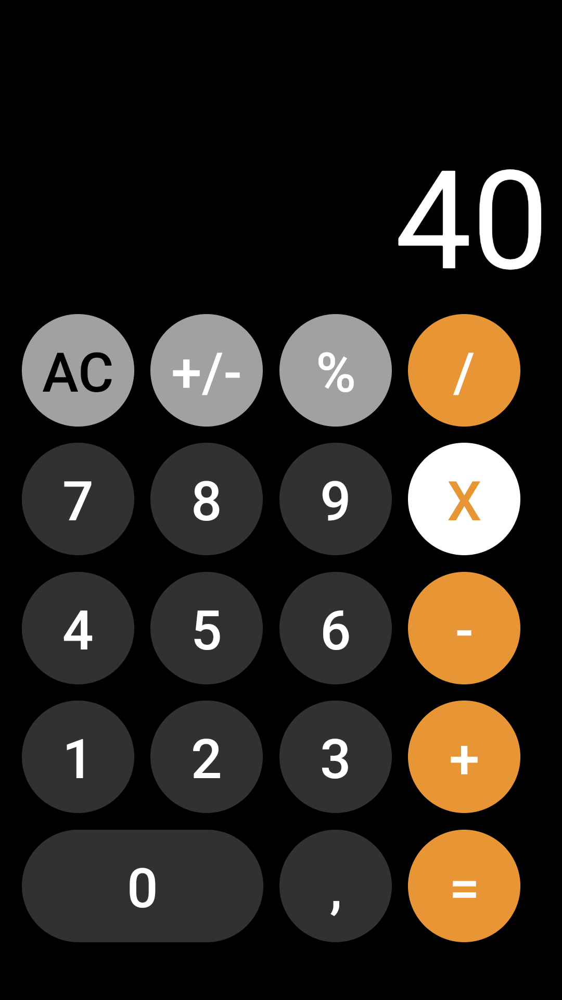

# 🧮 Clone da Calculadora do iOS

Projeto desenvolvido em **React Native** que emula a funcionalidade da calculadora do iOS, oferecendo uma experiência fluida e intuitiva para cálculos matemáticos.

## 🚀 Tecnologias Utilizadas

- **React Native**
- **JavaScript**
- **Expo**

## 📱 Captura de Tela



## 🛠️ Como Executar o Projeto

### 📌 Pré-requisitos

Antes de começar, certifique-se de ter instalado:

- **Node.js**
- **Expo CLI**
- **Emulador ou dispositivo físico**

### 📌 Passos para Rodar o Projeto

1. Clone o repositório:
   ```sh
   git clone https://github.com/vinisantos2/calculadoraIOS
   cd seu-repositorio
   ```

2. Instale as dependências:
   ```sh
   npm install
   ```

3. Execute o projeto:
   ```sh
   npx expo start
   ```

4. Escaneie o QR Code no **Expo Go** para rodar no celular ou execute em um emulador.

## 📌 Funcionalidades

- Interface similar à calculadora do iOS.
- Suporte a operações básicas como soma, subtração, multiplicação e divisão.
- Animações suaves para melhor experiência do usuário.

## 🤝 Contribuição

Sinta-se à vontade para contribuir com o projeto! Para isso:

1. Faça um **fork** do repositório.
2. Crie uma **branch** para sua feature (`git checkout -b minha-feature`).
3. Faça o **commit** (`git commit -m 'Adicionando nova feature'`).
4. Faça o **push** para a branch (`git push origin minha-feature`).
5. Abra um **Pull Request**.

## 📄 Licença

Este projeto está sob a licença **MIT**. Sinta-se livre para usá-lo e modificá-lo conforme necessário.

---

Desenvolvido com ❤️ por Marcus vincius (https://github.com/seu-usuario) 🚀

